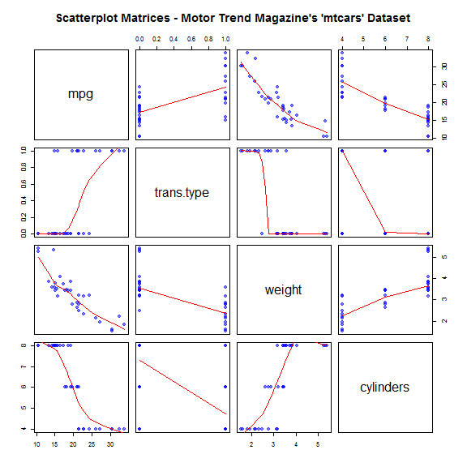
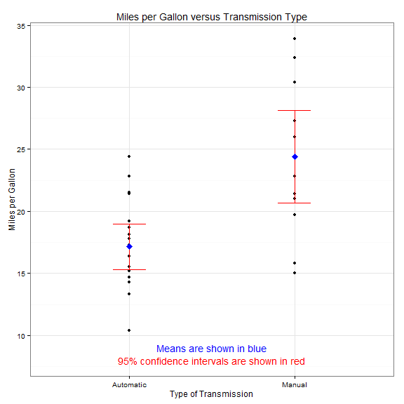
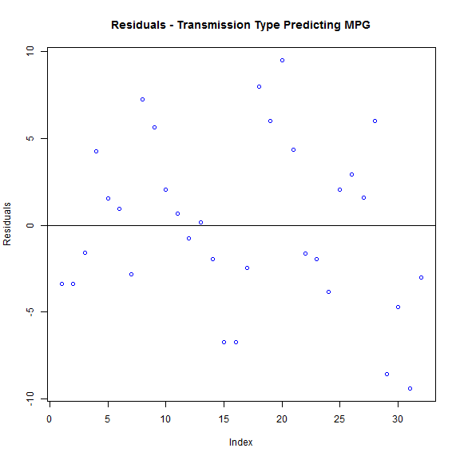

.
### Regression Models: Assignment 1


.

## An Analysis of the Relationship Between Miles per Gallon and Vehicle Transmission 
===================================================================================
     
### Executive Summary   
    
The goal of the analysis was to explore Motor Trend Magazine's 1974 dataset, which
comprises fuel consumption and 10 aspects of automobile design and performance for 
32 automobiles. The analysis seek answers to a couple of questions related to the 
impact of the automobile's type of transmission and its impact on miles per gallon (MPG). 
Specifically, the analysis sought to determine which type of transmission is better 
for MPG and to quantify the difference in MPG when comparing automatic versus manual
automobile transmissions.   

Our overall hypothesis is that while a manual transmission when considered in isolation 
may serve to increase an automobile's resulting MPG, there are other factors such as weight
and the number of cylinders, for example, that may have a larger impact on the final observed
MPG figures.   

### Data Processing and Analysis

Read in the dataset and rename some of the column headings so they are more easily interpreted.
Further, we create a new column in the dataset to contain a more descriptive entry
for the transmission type.


```r
library(ggplot2)
data(mtcars)
wm <- as.data.frame(mtcars)

colnames(wm)[2] <- "cylinders"
colnames(wm)[6] <- "weight"
colnames(wm)[9] <- "trans.type"

for (i in 1:(nrow(wm))) {
    if (wm$trans.type[i] == 0) {
        wm$trans_descr[i] <- "Automatic"
    }
    if (wm$trans.type[i] == 1) {
        wm$trans_descr[i] <- "Manual"
    }
}
```


The field "trans.type" indicates the type of transmission (0 = automatic, 1 = manual).
We first do some initial exploratory analysis of our dataset by producing a 'pairs'
plot to look for relationships between a few variables. We are especially interested 
in relationships of variables to MPG.


```r
pairs(~mpg + trans.type + weight + cylinders, data = wm, panel = panel.smooth, 
    main = "Scatterplot Matrices - Motor Trend Magazine's 'mtcars' Dataset", 
    pch = 19, col = rgb(0, 0, 1, 0.5))
```




The first row of the scatterplots shows that MPG increases as a change is made from 
an automatic transmission (trans.type = 0) to a car with a manual transmission 
(trans.type = 1). Continuing along that row, one can see that MPG falls as the weight
of the automobile increases and as the number of cylinders present in the vehicle
increases.   

We will now investigate the relative significance of these observations by running
several statistical regressions.   

The first regression is MPG versus transmission type. Note: Since we are using 'trans.type'
as a factor variable in a model without the intercept term, the resulting estimated coefficients will be the estimated average values for MPG for each type of transmission.


```r
fit1 <- lm(mpg ~ factor(trans_descr) - 1, data = wm)
summary(fit1)
```

```
## 
## Call:
## lm(formula = mpg ~ factor(trans_descr) - 1, data = wm)
## 
## Residuals:
##    Min     1Q Median     3Q    Max 
## -9.392 -3.092 -0.297  3.244  9.508 
## 
## Coefficients:
##                              Estimate Std. Error t value Pr(>|t|)    
## factor(trans_descr)Automatic    17.15       1.12    15.2  1.1e-15 ***
## factor(trans_descr)Manual       24.39       1.36    17.9  < 2e-16 ***
## ---
## Signif. codes:  0 '***' 0.001 '**' 0.01 '*' 0.05 '.' 0.1 ' ' 1
## 
## Residual standard error: 4.9 on 30 degrees of freedom
## Multiple R-squared:  0.949,	Adjusted R-squared:  0.945 
## F-statistic:  277 on 2 and 30 DF,  p-value: <2e-16
```


Based on a review of the model's summary statistics, the type of transmission is statistically
significant in terms of predicting the vehicle's MPG. As mentioned above, the resulting estimated coefficients are the estimated average values for MPG for each type of transmission.

The estimated mean figure for automatic transmission vehicles is **17.15 miles per gallon** and for manual transmission vehicles it is **24.39 miles per gallon**. 

**Therefore, this model would predict a manual transmission is generally better for improved miles per gallon. More specifically, the estimated increase in miles per gallon when using a vehicle with a manual transmission (versus one with an automatic transmission) is 7.24.**

We now plot the results of the first regression:


```r
stat_sum_df <- function(fun, geom = "crossbar", ...) {
    stat_summary(fun.data = fun, colour = "red", geom = geom, width = 0.2, ...)
}

plot_fit1 <- qplot(factor(trans_descr), mpg, data = wm, main = "Miles per Gallon versus Transmission Type", 
    xlab = "Type of Transmission", ylab = "Miles per Gallon") + theme_bw() + 
    annotate("text", x = 1.5, y = 9, label = "Means are shown in blue", col = "blue") + 
    annotate("text", x = 1.5, y = 8, label = "95% confidence intervals are shown in red", 
        col = "red") + stat_sum_df("mean_cl_normal", geom = "errorbar") + stat_summary(fun.y = "mean", 
    geom = "point", shape = 23, size = 3, fill = "blue", col = "blue")

plot_fit1
```



As mentioned above, the estimated mean figure for automatic transmission vehicles is **17.15 miles per gallon** and for manual transmission vehicles it is **24.39 miles per gallon**. 

We now will plot the residuals resulting from this regression:


```r
plot(resid(fit1), ylab = "Residuals", main = "Residuals - Transmission Type Predicting MPG", 
    col = "blue")
abline(0, 0)
```




It is reassuring to see there does not seem to be a pattern in the residuals.

As a further diagnostic check we will review variance influence measures by running the
'influence.measures' suite of functions in R and looking to see if any entries are "*" 
in the output's "inf" column.


```r
influence.measures(fit1)
```

```
## Influence measures of
## 	 lm(formula = mpg ~ factor(trans_descr) - 1, data = wm) :
## 
##                     dfb.f._.A dfb.f._.M    dffit cov.r   cook.d    hat inf
## Mazda RX4             0.00000 -2.06e-01 -0.20622 1.120 2.16e-02 0.0769    
## Mazda RX4 Wag         0.00000 -2.06e-01 -0.20622 1.120 2.16e-02 0.0769    
## Datsun 710            0.00000 -9.61e-02 -0.09614 1.151 4.76e-03 0.0769    
## Hornet 4 Drive        0.20934 -1.62e-17  0.20934 1.071 2.21e-02 0.0526    
## Hornet Sportabout     0.07554 -3.83e-18  0.07554 1.122 2.94e-03 0.0526    
## Valiant               0.04630  2.26e-18  0.04630 1.127 1.11e-03 0.0526    
## Duster 360           -0.13912 -1.40e-18 -0.13912 1.103 9.89e-03 0.0526    
## Merc 240D             0.36666 -3.33e-17  0.36666 0.962 6.42e-02 0.0526    
## Merc 230              0.28120 -1.14e-17  0.28120 1.026 3.90e-02 0.0526    
## Merc 280              0.10000  4.54e-18  0.10000 1.116 5.14e-03 0.0526    
## Merc 280C             0.03171 -5.22e-19  0.03171 1.128 5.20e-04 0.0526    
## Merc 450SE           -0.03631  1.91e-18 -0.03631 1.128 6.82e-04 0.0526    
## Merc 450SL            0.00741  1.30e-19  0.00741 1.130 2.84e-05 0.0526    
## Merc 450SLC          -0.09485  8.72e-18 -0.09485 1.117 4.63e-03 0.0526    
## Cadillac Fleetwood   -0.33922  2.30e-17 -0.33922 0.984 5.56e-02 0.0526    
## Lincoln Continental  -0.33922  2.30e-17 -0.33922 0.984 5.56e-02 0.0526    
## Chrysler Imperial    -0.11939  3.49e-18 -0.11939 1.110 7.31e-03 0.0526    
## Fiat 128              0.00000  5.08e-01  0.50765 0.947 1.20e-01 0.0769    
## Honda Civic           0.00000  3.72e-01  0.37228 1.037 6.78e-02 0.0769    
## Toyota Corolla        0.00000  6.16e-01  0.61636 0.866 1.70e-01 0.0769    
## Toyota Corona         0.21440  7.06e-19  0.21440 1.068 2.31e-02 0.0526    
## Dodge Challenger     -0.08017 -1.05e-18 -0.08017 1.121 3.31e-03 0.0526    
## AMC Javelin          -0.09485  8.72e-18 -0.09485 1.117 4.63e-03 0.0526    
## Camaro Z28           -0.18892  2.08e-17 -0.18892 1.081 1.81e-02 0.0526    
## Pontiac Firebird      0.10000  0.00e+00  0.10000 1.116 5.14e-03 0.0526    
## Fiat X1-9             0.00000  1.76e-01  0.17635 1.130 1.59e-02 0.0769    
## Porsche 914-2         0.00000  9.71e-02  0.09707 1.150 4.86e-03 0.0769    
## Lotus Europa          0.00000  3.72e-01  0.37228 1.037 6.78e-02 0.0769    
## Ford Pantera L        0.00000 -5.49e-01 -0.54916 0.916 1.39e-01 0.0769    
## Ferrari Dino          0.00000 -2.88e-01 -0.28757 1.084 4.14e-02 0.0769    
## Maserati Bora         0.00000 -6.08e-01 -0.60773 0.872 1.66e-01 0.0769    
## Volvo 142E            0.00000 -1.82e-01 -0.18155 1.128 1.68e-02 0.0769
```


Due to the absence of any asterisks, we have greater confidence there are no values in our
dataset that are highly leveraging and/or influencing our results.  


As we saw above in the panel plots, other variables, such as weight, seem to influence a vehicle's final MPG to a larger extent than transmission type. We now run another regression to test that supposition by including the vehicle's weight as a confounder.


```r
fit2 <- lm(mpg ~ weight + factor(trans_descr), data = wm)
summary(fit2)
```

```
## 
## Call:
## lm(formula = mpg ~ weight + factor(trans_descr), data = wm)
## 
## Residuals:
##    Min     1Q Median     3Q    Max 
## -4.530 -2.362 -0.132  1.403  6.878 
## 
## Coefficients:
##                           Estimate Std. Error t value Pr(>|t|)    
## (Intercept)                37.3216     3.0546   12.22  5.8e-13 ***
## weight                     -5.3528     0.7882   -6.79  1.9e-07 ***
## factor(trans_descr)Manual  -0.0236     1.5456   -0.02     0.99    
## ---
## Signif. codes:  0 '***' 0.001 '**' 0.01 '*' 0.05 '.' 0.1 ' ' 1
## 
## Residual standard error: 3.1 on 29 degrees of freedom
## Multiple R-squared:  0.753,	Adjusted R-squared:  0.736 
## F-statistic: 44.2 on 2 and 29 DF,  p-value: 1.58e-09
```

By looking at the summary statistics of the second regression model, we see the presence of the 
"weight" variable in the regression model renders the transmission type no longer statistically 
significant. This suggests when holding vehicle weight constant the transmission type on its own
does not significantly influence a vehicle's MPG.

In conclusion, our overall hypothesis was correct: A manual transmission likely serves to increase an automobile's resulting MPG when we do not control for other possible confounders. After holding other variables constant, such as the vehicle's weight, the transmission type's impact on MPG is no longer statistically significant.


.


