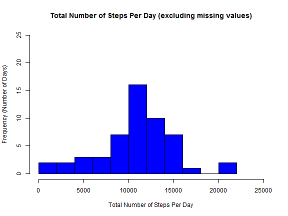

# PA1_template.Rmd
========================================================


## Assignment 1 - Reproducible Research 

This assignment makes use of data from a personal activity monitoring device. The device collects data at five-minute intervals throughout the day. The data consists of two months of data from an anonymous individual collected during the months of October and November, 2012 and include the number of steps taken in five-minute intervals each day.

### Data

The data for this assignment can be downloaded from the course web site at the following location:

   https://d396qusza40orc.cloudfront.net/repdata%2Fdata%2Factivity.zip

The variables included in this dataset are:

- steps: Number of steps taking in a five-minute interval (missing values are coded as 'NA')

- date: The date on which the measurement was taken in YYYY-MM-DD format

- interval: Identifier for the five-minute interval in which measurement was taken

The dataset is stored in a comma-separated-value (CSV) file format and contains a total of 17,568 observations.


### Loading and preprocessing the data

We begin by loading the required libraries and the source dataset.


```r
library(lattice)

wm <- as.data.frame(read.csv(file = "activity.csv", header = TRUE))
```


In the original dataframe, the field 'date' is a factor variable. To calculate the minimum and maximum day in the dataset, we need to temporarily convert that field to a class of 'date'. The resulting 'ttl_days' variable contains the total number of days for which data was collected for the analysis.

Note: Simple subtraction gives the number of days between the the maximum and minimum date. Therefore, we add one to the end to give the actual total number of days between October 1 and November 30.


```r
min_date <- min(as.Date(wm$date))
max_date <- max(as.Date(wm$date))
ttl_days <- as.numeric(max_date - min_date) + 1
```


First, we remove incomplete rows from the original dataframe.
The logical vector 'complete.cases(wm)' has 'TRUE's wherever a row's entry is
non-NA in all three columns and 'FALSE' otherwise. Applying this vector to the rows of the original dataframe (wm) subsets the original dataframe by only keeping the complete rows.


```r
wm_no_NA <- wm[complete.cases(wm), ]
```


The number of rows with NAs is the difference between the number of rows in the original dataframe and the number of rows in the dataframe after 'complete.cases' has been applied.


```r
numb_of_NAs <- nrow(wm) - nrow(wm_no_NA)
```


### What is mean total number of steps taken per day?

We calculate the total number of steps per day via the 'tapply' function by summing the number of steps in the dataframe using distinct values in the 'date' field as the INDEX (or 'group by') variable. We convert the results of the tapply function from an array to a dataframe. Finally, create a new column in the resulting dataframe to contain the 'date' field formatted with the class type 'Date' and format the 'steps' field to be of type 'integer'

Note: The desired entries for the 'date' field are also the rownames in the dataframe.


```r
ttl_stps_day <- as.data.frame(tapply(wm_no_NA$steps, INDEX = wm_no_NA$date, 
    FUN = "sum", na.rm = TRUE))
colnames(ttl_stps_day) <- "steps"
ttl_stps_day$date <- as.Date(rownames(ttl_stps_day))
ttl_stps_day$steps <- as.integer(ttl_stps_day$steps)
```


Calculate the mean and median number of steps per day. Note: One needs to remove NAs in the daily totals before calculating the mean and median or else will we will not get any results


```r
mean_no_NA <- mean(ttl_stps_day$steps, na.rm = TRUE)
median_no_NA <- median(ttl_stps_day$steps, na.rm = TRUE)
```


Draw the histogram showing the frequency of 'total number of steps per day


```r
hist(ttl_stps_day$steps, main = "Total Number of Steps Per Day (excluding missing values)", 
    xlab = "Total Number of Steps Per Day", ylab = "Frequency (Number of Days)", 
    breaks = 10, xlim = c(0, 25000), ylim = c(0, 25), col = "blue")
```




Based on this data with the missing values removed, the mean for the total number of steps per day is **10766.19**. 

Based on this data with the missing values removed, the median for the total number of steps per day is **10765**.   

### What is the average daily activity pattern?

There are two ways to calculate the average number of steps per interval. The first is to take the total number of steps per interval (summed across all days in the study) and divide by the total number of days in the analysis. This approach uses 61 days (Oct 1 through Nov 30) as the denominator in the calculation for all individual intervals. This approach ignores the fact that not every day in the 61-day period reported data. Dividing by 61 lowers the mean number of steps by interval versus dividing the total steps in the interval by the actual number of days contributing to that total.

The approach adopted here divides the total number of steps in the interval by the total number of days contributing to the total--essentially removing the number of days without data having been reported from denominator. This is accomplished via the 'tapply' function.

Convert the resulting array to a dataframe, add a column name, and create a new field ('interval') in the dataframe that contains the actual five-minute time interval corresponding to the calculated means. Note: The desired entries for the 'interval' field are also the rownames in the dataframe.


```r
mean_stps_per_intvl <- as.data.frame(tapply(wm_no_NA$steps, INDEX = wm_no_NA$interval, 
    FUN = "mean", na.rm = TRUE))
colnames(mean_stps_per_intvl) <- "avg_steps"
mean_stps_per_intvl$interval <- rownames(mean_stps_per_intvl)
```

To find the time interval with the highest average number of steps, first create a logical vector ('is_max') that will be filled with FALSEs for all time intervals that are not the one whose value is the maximum. The location in the logical vector of the 'TRUE' will be the time interval we want. Applying that logical vector to the rows of the full dataframe will subset it and only leave the row corresponding to the desired maximum.


```r
is_max <- (mean_stps_per_intvl$avg_steps == max(mean_stps_per_intvl$avg_steps))
max_mean_stps_per_intvl <- mean_stps_per_intvl[is_max, ]

max_interval <- max_mean_stps_per_intvl[1, 2]
```


Plot the average number of steps (y-axis) versus the time interval (x-axis) using a line graph.


```r
plot(mean_stps_per_intvl$interval, mean_stps_per_intvl$avg_steps, type = "l", 
    xlab = "Five-minute time period", ylab = "Avg number of steps", main = "Average Number of Steps by Time Interval (excluding missing values)")
```


Based on this data with the missing values removed, the five-minute interval that contains the maximum number of average steps per day is **835**. 

### Imputing missing values

Based in the discussion and accompanying code included above, the total number of rows with NAs is **2304**.


Of the number of possible alternatives, we used the 'mean value of steps per interval' previously calulated to fill in the missing values in the 'steps' column in the original dataset.
In order to do that, we merge the two dataframes (the one with the mean number of steps
and the original dataset) using the common field called 'interval'. The results of the
merge are saved in a new dataframe called 'fill_in_NAs'.

Note: For ease of reviewing, the new  dataframe was sorted first by 'date' and then by time interval. The 'sort_order' vector contains the order of the rows if they were actually sorted in the desired order. Applying that vector to the 'fill_in_NAs' dataframe is where the actual row
sorting of the 'fill_in_NAs' dataframe takes place.


```r
fill_in_NAs <- (merge(mean_stps_per_intvl, wm, by = "interval"))
sort_order <- order(fill_in_NAs$date, as.numeric(fill_in_NAs$interval))
fill_in_NAs <- fill_in_NAs[sort_order, ]
```

Now we go through the dataframe 'fill_in_NAs' by row and create a new field called
'steps_no_NAs'. This new field will contain the number of steps without any missing values. If there is an 'NA' in the original 'steps' field, we populate the new column with the avg number of steps. If there is an actual value in the original 'steps' field, we use it. The new column 'steps_no_NAs' is similar to the original 'steps' field without any missing values. We use this new column in the calculations going forward.

Population of the new column is accomplished with the below 'for' loop.


```r
for (i in (1:nrow(fill_in_NAs))) {
    if (is.na(fill_in_NAs$steps[i])) {
        fill_in_NAs$steps_no_NAs[i] <- fill_in_NAs$avg_steps[i]
    } else {
        fill_in_NAs$steps_no_NAs[i] <- fill_in_NAs$steps[i]
    }
}
```


As above, we calculate the total number of steps per day via the 'tapply' function by
summing the number of steps in the dataframe using distinct values in the 'date' field 
as the INDEX (or 'group by') variable. We convert the results of the tapply function
from an array to a dataframe. Finally, create a new column in the resulting dataframe 
to contain the 'date' field formatted with the class type 'Date' and format the 
'steps' field to be of type 'integer'.
Note: The desired entries for the 'date' field are also the rownames in the dataframe.


```r
ttl_stps_day_imput <- as.data.frame(tapply(fill_in_NAs$steps_no_NAs, INDEX = fill_in_NAs$date, 
    FUN = "sum", na.rm = TRUE))
colnames(ttl_stps_day_imput) <- "steps"
ttl_stps_day_imput$date <- as.Date(rownames(ttl_stps_day_imput))
ttl_stps_day_imput$steps <- as.integer(ttl_stps_day_imput$steps)
```


Calculate the mean and median number of steps per day. Note: One needs to remove NAs in the
daily totals (via the na.rm = TRUE' option) before calculating the mean and median or else we will not get any results.


```r
mean_impute <- mean(ttl_stps_day_imput$steps, na.rm = TRUE)
median_impute <- median(ttl_stps_day_imput$steps, na.rm = TRUE)
```


Draw the histogram showing the frequency of 'total number of steps per day' (which now
include the imputed values for the previous NA entries). 


```r
hist(ttl_stps_day_imput$steps, main = "Total Number of Steps Per Day (imputing missing values)", 
    xlab = "Total Number of Steps Per Day", ylab = "Frequency (Number of Days)", 
    breaks = 10, xlim = c(0, 25000), ylim = c(0, 25), col = "orange")
```


Based on this data after imputing missing values, the mean for the total number of steps per day is **10766.16**. You will recall the corresponding mean value computed based on the dataset with missing values removed was **10766.19**. Based on this metric, the **2304** rows of missing data do not seem to have a material impact on the estimates of the total average daily number of steps.

Based on this data after imputing missing values, the median for the total number of steps per day is **10766**. You will recall the corresponding median value computed based on the dataset with missing values removed was **10765**. Based on this metric, the **2304** rows of missing data do not seem to have a material impact on the estimates of the total average daily number of steps.

### Are there differences in activity patterns between weekdays and weekends?

We begin by creating a logical vector filled with TRUEs and FALSEs corresponding to the results of whether the first letter of the entry in the 'date' field (after the 'weekdays' function is applied) begins with the letter 'S'. If it does begin with an 'S', we know that day is a weekend day. Otherwise, it is a weekday. Use the entries in this logical vector to assign the word 'weekend' or 'weekday' to a newly-created column in the large dateframe called 'fill_in_NAs'.  This new column will be used as a 'factor' variable in the graphing step below.


```r
weekend_log <- grepl("^[Ss]", weekdays(as.Date(fill_in_NAs$date)))

for (i in (1:nrow(fill_in_NAs))) {
    if (weekend_log[i] == TRUE) {
        fill_in_NAs$day_of_week[i] <- "weekend"
    } else {
        fill_in_NAs$day_of_week[i] <- "weekday"
    }
}
```


Compute the average number of steps taken by time interval separately for the (i) weekend
days and the (ii) weekday days. This is accomplished by using the 'aggregate' function with
a list of two fields in the 'by' parameter. This results in a dataframe by default being produced
with three columns. The first two columns are the determined by the 'by' variables ('interval' and 'day_of_week', resp). Column (3) contains the average number of steps per day corresponding to the column (1)-column (2) combination. Given that the third column is made up of "weekend" and "weekday" entries, this lends itself to easily being able to use the entries in this column as a factor variable when plotting.

Note: The 'tapply' function using the list of 'by' variables as the INDEX would produce 
similar results, but the output would be arranged by interval in column (1) with column (2) 
containing the averages for the weekdays and column (3) as the averages for the 
weekend days. This setup does not allow for a quick two-panel plot using the weekend/weekday 
indicator as a factor variable (since they are in different columns).

After using 'aggregate' function we use similar calculations to those explained earlier in the 
code. We also rename the columns and sort the resulting dataframe by ascending time 'interval'


```r
mean_stps_per_intvl_imput <- aggregate(fill_in_NAs$steps_no_NAs, by = list(fill_in_NAs$interval, 
    fill_in_NAs$day_of_week), FUN = "mean", na.rm = TRUE)
colnames(mean_stps_per_intvl_imput) <- c("interval", "weekday_weekend", "avg_steps")

sort_order <- order(as.numeric(mean_stps_per_intvl_imput$interval))
mean_stps_per_intvl_imput <- mean_stps_per_intvl_imput[sort_order, ]
```


Run the 'aggregate' function again to calculate the mean number of average steps (to two decimal
places) for both weekdays and weekends. The first row contains the info for weekdays and
the second for weekends.


```r
mean_by_day_type <- aggregate(fill_in_NAs$steps_no_NAs, by = list(fill_in_NAs$day_of_week), 
    FUN = "mean", na.rm = TRUE)
mean_weekdays <- round(mean_by_day_type[1, 2], 2)
mean_weekends <- round(mean_by_day_type[2, 2], 2)
```


Use the lattice system to create a two-panel plot with one column and two rows.
Treat the 'weekday_weekend' column entries as a 'factor' class variable to facilitate different
plots being produced. Prior to plotting, we also need to consider the 'interval' field as 
containing numerical entries rather than the current class of 'character'


```r
xyplot(avg_steps ~ as.numeric(interval) | as.factor(weekday_weekend), data = mean_stps_per_intvl_imput, 
    type = "l", layout = c(1, 2), col = c("blue"), main = "Average Number of Steps by Time Interval (imputing missing values)", 
    xlab = "Five-minute time period", ylab = "Avg number of steps")
```


Based on a review of these plots, even though the average maximum number of steps in any one interval occurs during the week, there is an overall higher number steps taken in the aggregate over the weekend.


.
